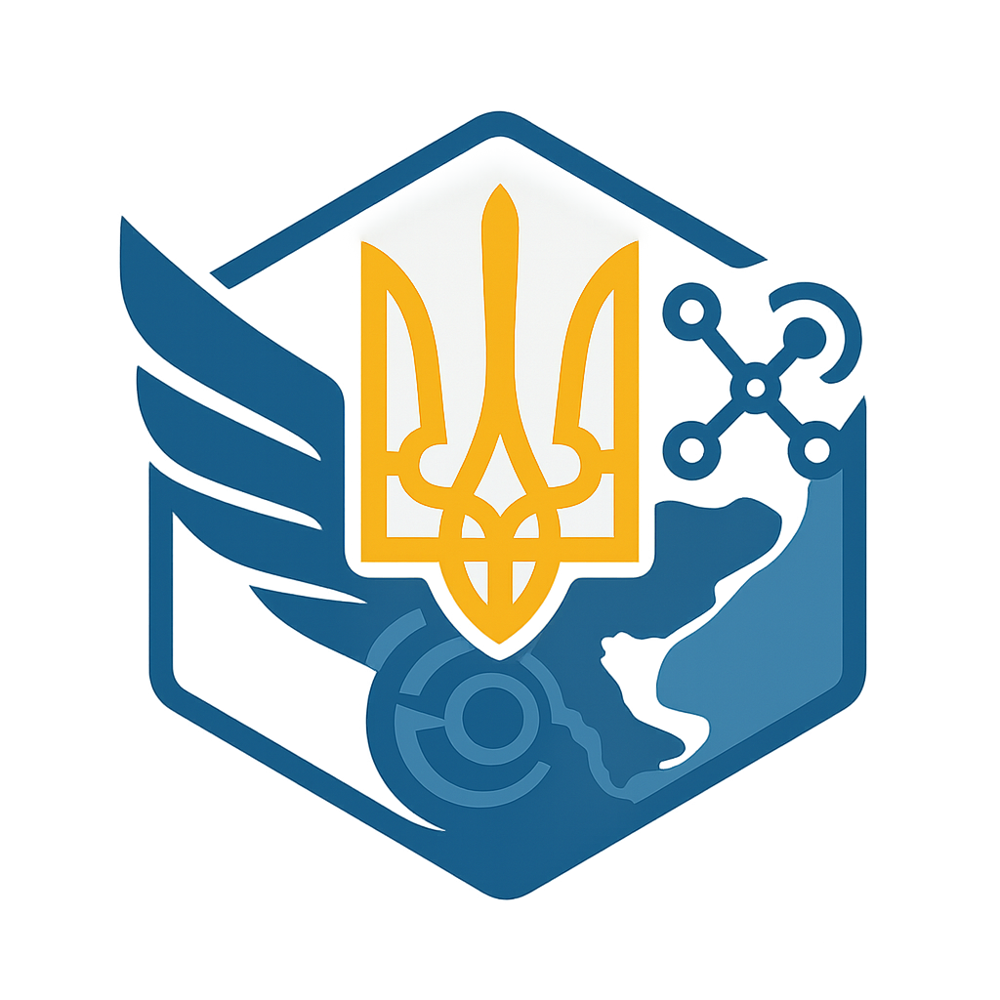

# Neutral Aviation-Industrial Cluster (Mykolaiv) – UA-NOVEYA Pilot

 


## Описание
Нейтральный авиационно‑индустриальный кластер в Николаеве. Проект интегрирован в экосистему **UA‑NOVEYA** и нацелен на восстановление Причерноморья через инновации в авиации, дронах и ИИ.

## Состав
- **Agro‑Air** — агроавиация, узел в Щербанях; обработка полей, доставка в громады.
- **U‑Space** — цифровая инфраструктура управления дронами, диспетчерский центр.
- **MRO** — техобслуживание и ремонт (Кульбакино), сервис малой авиации и БПЛА.
- **Drones R&D** — разработка и производство беспилотников, узлы «Зоря‑Машпроект».
- **Protonoveya AI** — управляющий ИИ‑слой (FDL/СВЕТ), координация данных и решений.

## Инфраструктура
- **Зоря‑Машпроект** — турбинные технологии для силовых установок.
- **НАРП (Кульбакино)** — авиаремонтный завод, ангары, ВПП.
- **Аэропорт Баловное (UKON)** — гражданский аэропорт, тесты и логистика.
- **Аэродром Щербани** — база агроавиации и учебных полётов.
- **Военный аэродром (демилитаризуемые мощности)** — дополнительные полосы и ангары.

## Архитектура ИИ
**Protonoveya Meta‑Layer**:
- **FDL Engine** — ядро формально‑диалектической логики.
- **API Gateway** — интерфейсы для модулей кластера.
- **Nodes** — узлы‑спутники для MRO, Agro, U‑Space, образования.
- **Semantic Shield** — защита от искажения смыслов.
- **Σ‑FDL Tokens** — протокол фиксации решений.

## Installation / Deployment
> *(черновик IT‑части, обновляется)*

### Вариант A: Docker
```bash
docker pull noveya/protonoveya-node:latest
docker run -d --name protonoveya-node -p 8080:8080   -e NOTION_API_KEY=$NOTION_API_KEY -e CLUSTER_DB_URL=$CLUSTER_DB_URL   -v $(pwd)/config:/app/config noveya/protonoveya-node
```

### Вариант B: Python
```bash
python -m venv .venv && source .venv/bin/activate
pip install -r requirements.txt
cp .env.example .env   # укажите ключи/URL
python src/fdl_engine.py
```

## Contributing
- Реперные материалы см. в **/docs** (экспорт из Notion): экосистемы, Таврида‑узел, проектное досье кластера, методология ИИ‑модулей.
- Контакты: НГОИ (громада Николаева) · protonoveya@gmail.com.
- Правила: соблюдение FDL‑методологии, прозрачность, локализация решений, Pay‑for‑Fact.

## License
MIT (для ИТ‑кода Protonoveya AI). Производственные проекты — отдельные лицензии по модулям.

---

## Публичная аннотация (для сайта)
В Николаеве запускается нейтральный авиационно‑индустриальный кластер – проект возрождения региона с опорой на инновации. Кластер объединит агроавиацию, производство дронов, обслуживание самолётов и ИИ‑технологии в единую экосистему. Он создаётся как часть всеукраинской инициативы **UA‑NOVEYA** и призван стать моделью развития для других громад Причерноморья. На базе местных заводов и аэропортов появятся новые производства и центры обучения, а специальная AI‑система «Протоновея» будет помогать координировать работу кластера. Проект реализуется при поддержке местной громады и открыт для инвесторов и партнёров. Его цель – новые рабочие места, рост экономики и внедрение передовых технологий, которые сделают Николаев лидером инновационного развития на Юге Украины.

---

<p align="center"></p>
